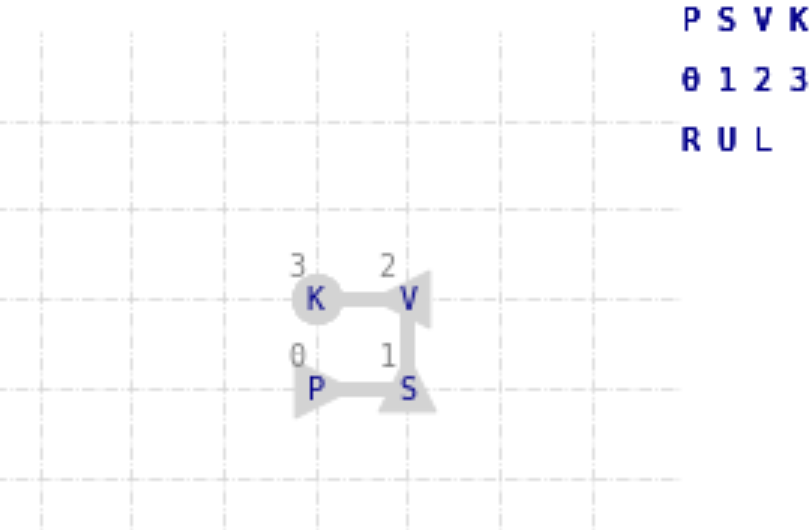

# qfold

This project attempts to replicate the results in [*Fingerhuth, 2018*](https://arxiv.org/pdf/1810.13411.pdf), which explored folding the 4 residue 'protein' PSVK on a 2D-lattice using a Quantum Alternating Operator Ansatz (QAOA).

Bulk of work is in:
- [**`final.ipynb`** ](https://github.com/slongwell/qfold/blob/master/final.ipynb) **Main notebook** - details lattice scheme, contact energy matrix, QAOA, and possible folds
- [**`hamiltonians.ipynb`** ](https://github.com/slongwell/qfold/blob/master/hamiltonians.ipynb) Organizes cost and mixer Hamiltonians from _Fingerhuth 2018_ (see module version below)
- [**`lattice.py`** ](https://github.com/slongwell/qfold/blob/master/lattice.py) Dictionaries that encode 2D-lattice scheme and function for plotting protein on 2D-lattice

Other dir/files:
- [**`docs/`** ](https://github.com/slongwell/qfold/tree/master/docs) PDFs of project description, proposal, update, and report
- [**`mat/`** ](https://github.com/slongwell/qfold/tree/master/mat) Contact energy matrices (Miyazawa-Jernigan) and corresponding indices (adapted from [LightDock](https://github.com/brianjimenez/lightdock/blob/master/docs/README.md))
- [**`images/`** ](https://github.com/slongwell/qfold/tree/master/images) Images used within notebooks and readme
- [**`hamiltonians.py`** ](https://github.com/slongwell/qfold/blob/master/hamiltonians.py) Module version of hamiltonians.ipynb
  - `jupyter nbconvert --to script hamiltonians.ipynb`

Requirements:
- jupyter
- pyquil
- numpy
- pandas
- scipy
- matplotlib
